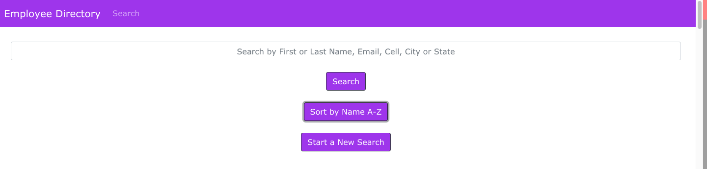
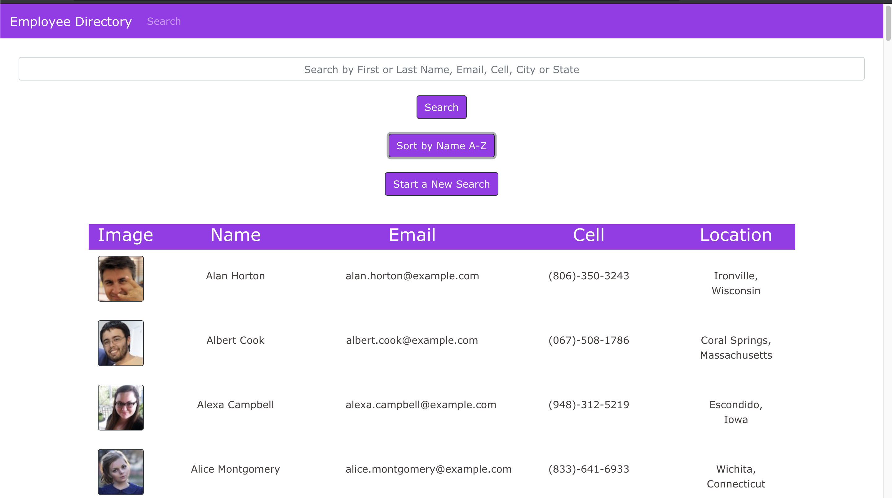
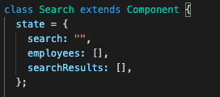

# employeeDirectory 

## Table of Contents

1. [Description](#description)
1. [Video Demo](#videodemo)
1. [Installation](#installation)
1. [Usage](#usage)
1. [License](#license)
1. [Contributing](#contributing)
1. [Tests](#tests)
1. [Deply](#deploy)
1. [Questions](#questions)

## Description

employeeDirectory is a React application that allows a user to view their entiree employee directory as soon as the page loads.  This allows the user to have quick access to important employee information including their first and last name, email,cell and location (city and state).  The rendered table of employees also includes their photo.  The table of employees can be searched by either providing a full search term such as the complete first name,  or only a few characters that will render the employee that has that information included in their name, email, phone or location.  The lisit can be sorted by the employees first name alphabetically.

## VideoDemo

## Installation

This is a single page application using React.  The dependencies installed  using npm are axios, react-router-dom and boostrap for styling.  Axios is used to gather the information from the Random User Generator API key.

## Usage

This application is a great wayto generate and sort through user data.  To get started with the application, visit the gh-pagese link included at the bottom of this readme.

  

  

   

## License

[The Unlicense](http://unlicense.org/)

This project is licensed under [The Unlicense](http://unlicense.org/). Please visit the link for more details.

## Contributing

There were no contributors on this project, but collaboration is welcome. Please feel free to reach out to me regarding changes to the application by creating an issue in Github or contacting me through email.

## Tests

Each employee is tracked with a uinique id saved to the key attribute. This application uses state management for the state of the employees, searchbar and search results.  Use React Dev Tools for a views of their states.

   

## Deploy

[Click here to access the deployed application](https://dargenioa.github.io/employeeDirectory/)
  
## Questions

**Github:** [dargenioa](http://github.com/dargenioa)

**Email:** [dargenioa14@gmail.com](dargenioa14@gmail.com)

For additional questions please feel free to contact me.
